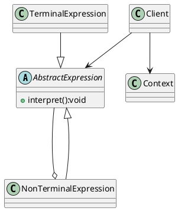

**反思:自己做的笔记应该让自己和所有人都能看懂，不要东一下西一下。最好有专门的笔记，针对所学的每一章内容**

#### 解释器模式

1.需求：通过解释器模式 实现四则运算

+ 先输入表达式的形式，比如a+b-c+d+e
+ 在分别输入a,b,c,d,e的值
+ 最后求出结果

2.传统做法：

+ 编写一个方法，接受表达式的形式，然后根据用户输入的数值进行解析、得到结果
+ 问题：如果加入新的运算符，不利于。另外让一个方法来解析表达式，结构不是很清晰。
+ 解释器模式： 表达式 == 解释器 ==> 结果

##### 解释器模式的介绍

1) 编译原理中：算术表达式 ==词法分析器==> 词法单元。词法单元 ==语法分析器==> 语法分析树 这里词法分析器和语法分析器都可以认为是解释器
2) 解释器模式:给定一个语言表达式，定义它的**文法的一种表示**，并**定义一个解释器**，使用该解释器来解释语言的句子[表达式]
3) 应用场景:
    + 将一个需要解释执行的语言中的句子表示为一个抽象语法树
    + 一些重复出现的问题用一种简单的语言表达
    + 一个简单语法需要解释
4) 编译器，运算表达式，正则表达式，机器人 等都可以应用解释器模式



手动实现一个解释器[只可以解析含有+/-的表达式]

+ 原理:我们把表达式进行toCharArray()，这个toCharArray()就是一个词法分析器。当然因为我们要解释的表达式很简单，所以词法分析器就是这么简单...
+ 同时我们用 **栈**模拟抽象语法树的构建[很多情况下，栈和树都是一体的]，因此我们用很多Expression类模拟了语法分析器，构建了一个抽象语法树...
+ 最后，我们使用栈模拟树的遍历，递归[这里用栈替代了递归过程..]的计算了表达式

分析一下SpelExpression 的解析执行的 相关流程。

```java
// 定义了模板的规范，即形如#{}会被解析
public interface ParserContext {
    ParserContext TEMPLATE_EXPRESSION = new ParserContext() {
        public boolean isTemplate() {
            return true;
        }

        public String getExpressionPrefix() {
            return "#{";
        }

        public String getExpressionSuffix() {
            return "}";
        }
    };

    boolean isTemplate();

    String getExpressionPrefix();

    String getExpressionSuffix();
}
```

```java
// 如果我们在这个 TemplateAwareExpressionParser的解析器里，不传入context对象，于是context就是null
// 所以parser知道我们要解析的就不是模板字符串。
public abstract class TemplateAwareExpressionParser implements ExpressionParser {
    public Expression parseExpression(String expressionString, @Nullable ParserContext context) throws ParseException {
        return context != null && context.isTemplate() ? this.parseTemplate(expressionString, context) : this.doParseExpression(expressionString, context);
    }
    
    // 于是我们进入了这个方法里，可以看到，这个方法是待子类实现的，因为不是模板的表达式也有很多分类，具体就由子类实现。
    // 因此parser根据context的不同，以及Expression实现子类的不同，决定了解析一个表达式字符串后决定生成的Expression对象是什么样的。
   protected abstract Expression doParseExpression(String expressionString, @Nullable ParserContext context) throws ParseException;
}
```

##### 总结
+ 当一个语言需要动态解析一个表达式时，就需要使用到抽象语法树 [最经典的就是EL(expression language)]
+ 设计方式就是，我们手动的设计一个 词法分析器 和 语法分析器，最后生成一个表达式对象。用户把表达式字符串交给解释器，就可以获得一个表达式对象
+ 词法分析器和语法分析器 按照要实现的表达式，通常设计较为复杂。通常体现在一个外部的类中，比如Parser/Calculator来实现。
+ 应用场景 ==> 编译器，运算表达式计算，正则表达式，机器人
+ 问题 ==> 类膨胀[相当于在一个语言里嵌入一个解释器]，由于要递归计算语法树[或者不用递归，用栈处理]，会导致调试复杂， 效率低。

